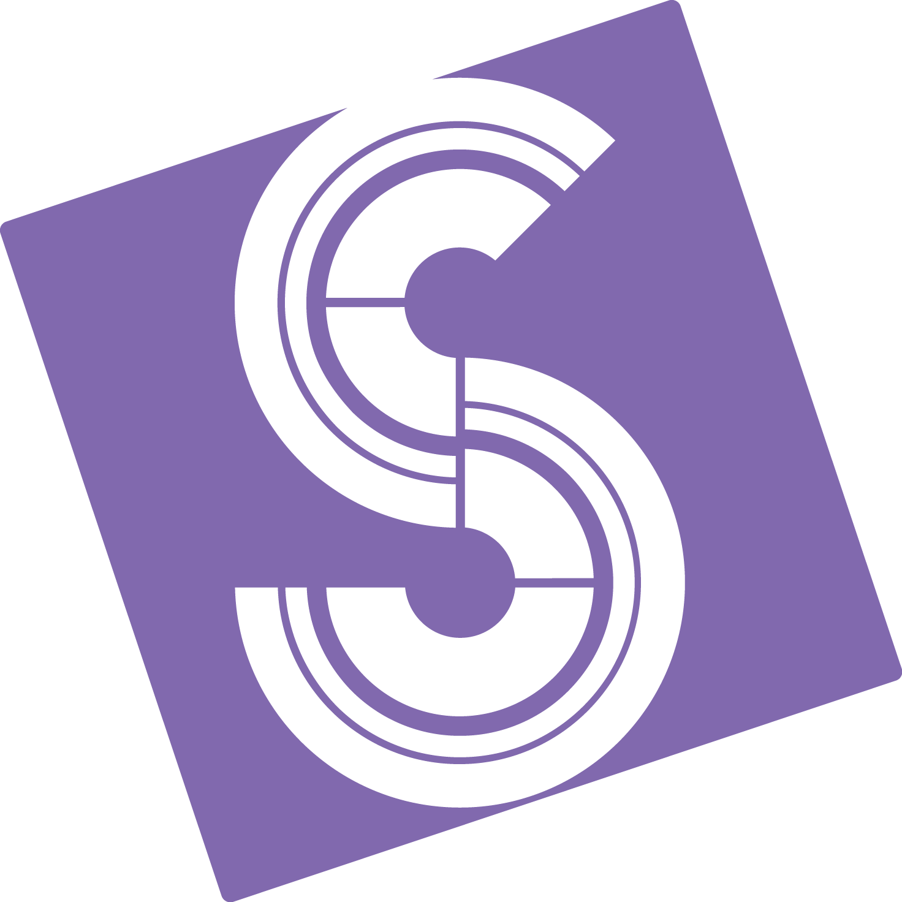

# SeventeenSierra

# Alyssa Feola's personal website.

## Contributing 💪

Please check the [Contribution guidelines](CONTRIBUTING.md) before opening yours 🙏

### Please submit a PR if you notice:

- spelling/grammar issue
- broken link
- things that should be in the 'about me' section
- documentation that needs updating

### Please submit a regular Issue if you notice:

- something isn't work
- ideas for better sections
- a bug
- feature request
- ### Please submit a discussion Issue if you have a:
- question
- idea
- show and tell

## License 📝

MIT.

